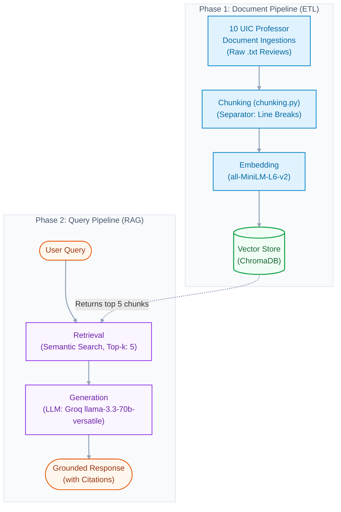

# Project 1 Planning: The Unofficial Guide

> Write this document before you write any pipeline code.
> Your spec and architecture diagram are what you'll use to direct AI tools (Claude, Copilot, etc.) to generate your implementation — the more specific they are, the more useful the generated code will be.
> Update the Retrieval Approach and Chunking Strategy sections if you change your approach during implementation.
> Update this file before starting any stretch features.

---

## Domain

<!-- What domain did you choose? Why is this knowledge valuable and hard to find through official channels? -->
The domain that I choose was "Course and Professors Reviews at UIC". The reason why I chose this domain is because I am a rising transfer Junior at UIC and I am simply not familiar with the professors or the space at all. Sure I can go ahead a search each professor in Rate My Professor, but that will take too much time, and if I want to compare professors I have to make sure that they have similar classes. The reason why this knowledge is hard to find is simply because theres dozens of professors and remembering all of them and how they rank can be difficult. 
---

## Documents

<!-- List your specific sources: URLs, subreddit names, forum threads, or file descriptions.
     Aim for at least 10 sources that together cover different subtopics or perspectives within your domain. -->

| # | Source | Description | URL or location |
|---|--------|-------------|-----------------|
| 1 | RMP | RMP Info for Abolfazl Asudeh  | documents\Abolfazl_Asudeh.txt |    
| 2 | RMP | RMP Info for Natalie Parde | documents\Natalie_Parde.txt |
| 3 | RMP | RMP Info for Jason Polakis | documents\Jason_Polakis.txt |
| 4 | RMP | RMP Info for Pat Troy | documents\Pat_Troy.txt |
| 5 | RMP | RMP Info for Luis Pina | documents\Luis_Pina.txt |
| 6 | RMP | RMP Info for Shanon Reckinger | documents\Shanon_Reckinger.txt |
| 7 | RMP | RMP Info for Sara Riazi | documents\Sara_Riazi.txt |
| 8 | RMP | RMP Info for Pedram Rooshenas | documents\Pedram_Rooshenas.txt |
| 9 | RMP | RMP Info for Anastasios Sidiropoulos | documents\Anastasios_Sidiropoulos.txt |
| 10 | RMP | RMP Info for Robert H. Sloan| documents\Robert_H_Sloan.txt|

---

## Chunking Strategy

<!-- How will you split documents into chunks?
     State your chunk size (in tokens or characters), overlap size, and explain why those
     numbers fit the structure of your documents.
     A review-heavy corpus warrants different chunking than a long FAQ. -->

     Since my documents are short reviews who are all seperated by a line spacing and are all equal length, I will split the documents into chunks by checking where there is a \n\n in the documents. In this case there will be no overlapping since the documents will all break off evenly. I will know if my chunks are too small or too large by simply looking at what is indside the chunk. All chuncks follow a format of Quality at the top, and word descriptions at the buttom, so all i need to look for is that those two thing are always at the beginnign and end of the chunk.

**Chunk size:**
Since these reviews are short and of equal spacing, to determine the chunk size I will simply look for where there is a \n\n in the documents.
**Overlap:**
There will be 0 overlapping since all reviews are seperated by a \n\n
**Reasoning:**
Since I inputted the data manually, I know how the reviews are spaced out making it easier to include the whole review without being confined to character limitations or tokens.

---

## Retrieval Approach

<!-- Which embedding model are you using (e.g., all-MiniLM-L6-v2 via sentence-transformers)?
     How many chunks will you retrieve per query (top-k)?
     If you were deploying this for real users and cost wasn't a constraint, what tradeoffs
     would you weigh in choosing a different embedding model — context length, multilingual
     support, accuracy on domain-specific text, latency? -->

**Embedding model:**
The embedding model that I will be using is all-MiniLM-L6-v2 vi sentence-transformers. The reason for this is that this model can use vectors to capture meaning, not just keyword matches. This model also runs locally, no API key, has 384-dimesional vectors, is fast, and is accurate for short English reviews. 
**Top-k:**
Top-k will start off at 4 to not add to much noise to the LLM, but if the results are not as accurate I can easily bump this number to 5-6 since each professors has an average of 10+ reviews. 
**Production tradeoff reflection:**
If I deployed this for real users with cost off the table, I'd move from all-MiniLM-L6-v2 to a stronger model like OpenAI's text-embedding-3-large or all-mpnet-base-v2, weighing four tradeoffs. The reasons for these are as follow:

- Domain accuracy: RMP reviews use slang, sarcasm, and emojis. A more capable model captures that informal tone better than MiniLM.

- Context length: a longer input limit lets me embed larger or more detailed review chunks without truncating them.
- Multilingual support: UIC has many international students, so reviews may mix languages or non-native phrasing — a multilingual model retrieves those reliably.
- Latency: larger models are slower, so I'd balance the accuracy gain against keeping responses fast enough that users don't wait.
---

## Evaluation Plan

<!-- List your 5 test questions with their expected correct answers.
     Questions should be specific enough that you can judge whether the system's response
     is right or wrong. "What are good dining halls?" is too vague.
     "What do students say about wait times at [dining hall name] during lunch?" is testable. -->

| # | Question | Expected answer |
|---|----------|-----------------|
| 1 | Is workload something I should worry about when walking into Polakis class? | Multiple reviews state how his class is Lecture heavy, has a lot of homework assignments, and the material is super heavy|
| 2 | Is it easy to get a hold of Anastasios Sidiropoulos if I ever get lost on any assignments or have questions? | Most reviews talk about how caring this professor is and how he is willing to help anyone who has a question for him.|
| 3 | What is one praise most of Prof Pina students have about his class structure? | Most reviews talk about how they love how incerdibly organized class is. |
| 4 | Which professor has the highest overall ranking? | Based on the provided information Luis Pina has the best overall ranking of all professors. |
| 5 | Are there any exams in professors Natalie Parde class? | There are comnflicting reviews for this, some say that there are exams but dont really specify the amount. One thing that they do mention is how long the exams they have are and how they can be tough. The reviews also talk about homework assignments and semester long projects that are easy to follow thanks to the instructions and resources she provides. |

---

## Anticipated Challenges

<!-- What could go wrong? Name at least two specific risks with reasoning.
     Consider: noisy or inconsistent documents, missing source attribution, off-topic
     retrieval, chunks that split key information across boundaries. -->

1. One of the issues that could arise is that for some of the professors the reviews that they have might be too short or vague to answer the question of the user. For example if a professor only has reviews such as "Nice class!" or "Wouldnt recommend." When a user wants to know something about the course material the Model will simply not have any information to go off.

2. Another issue that may arise is conflicting information. Since some professors teach multiple classes and have been teaching for some time, reviews can often have conflict. For example a 2022 review by a User can say how his classes are easy and straightforward, but a 2024 review could say how the course is Lecture heavy and Tough.

---

## Architecture

<!-- Draw a diagram of your pipeline showing the five stages:
     Document Ingestion → Chunking → Embedding + Vector Store → Retrieval → Generation
     Label each stage with the tool or library you're using.
     You can use ASCII art, a Mermaid diagram, or embed a sketch as an image.
     You'll use this diagram as context when prompting AI tools to implement each stage. -->

---

## AI Tool Plan

<!-- For each part of the pipeline below, describe:
     - Which AI tool you plan to use (Claude, Copilot, ChatGPT, etc.)
     - What you'll give it as input (which sections of this planning.md, which requirements)
     - What you expect it to produce
     - How you'll verify the output matches your spec

     "I'll use AI to help me code" is not a plan.
     "I'll give Claude my Chunking Strategy section and ask it to implement chunk_text()
     with my specified chunk size and overlap" is a plan. -->

Milestone 3 — Ingestion and chunking:
I will use Claude and Gemini to process my planning and architecture files and generate a Python script that chunks reviews by \n\n spacing, verifying the output through manual inspection of the resulting data.

Milestone 4 — Embedding and retrieval:
Using the generated chunks alongside ChromaDB and all-MiniLM-L6-v2 configurations, I will write the embedding and retrieval functions to load the database and set a top-k of 5, verifying the pipeline by testing pre-answered questions and checking the cosine distance values.

Milestone 5 — Generation and interface:
I will integrate the retrieval logic, the Groq API (llama-3.3-70b-versatile) with strict system prompts, and the Gradio skeleton code into a complete app.py script, verifying the final interface by testing both relevant project queries and irrelevant, out-of-scope questions.